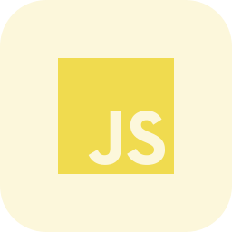
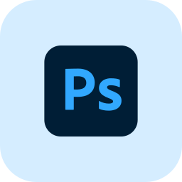

### Hello, I'm Bartek and I'm 22 years old 

### Developer • Arma 3 Enthusiast • High Readiness Unit

 
I'm a developer focused on **web development, backend systems, automation and Arma 3**.
 
🪖 **High Readiness Unit (HRU)** — Arma 3 military simulation community I'm building and developing for.

### 🔧 Currently building

- 🌐 HRU Website & Web Platform
- 🖥️ Arma 3 / Reforger Server Management
- 🤖 Discord Bot & Server Monitoring
- 🔐 Authentication, Applications & Admin Panel
- 🎮 Custom Arma 3 Scripts & Systems

### 💻 Tech

  <a href="https://www.typescriptlang.org/" target="_blank">
  <a href="https://developer.mozilla.org/en-US/docs/Web/JavaScript" target="_blank">
  <a href="https://react.dev/" target="_blank"> 
  <a href="https://nodejs.org/" target="_blank">
  <a href="https://www.w3schools.com/html/" target="_blank"> 
  <a href="https://www.w3schools.com/css/" target="_blank"> 
  <a href="https://discord.js.org/" target="_blank"> 
  <a href="https://www.mongodb.com/" target="_blank"> 
  <a href="https://git-scm.com/" target="_blank"> 
  <a href="https://github.com/" target="_blank"> 

 
 

### Softwares

  <a href="https://code.visualstudio.com/" target="_blank">
  

 
 
    > **Build. Improve. Deploy. Repeat.**
 
 
 
